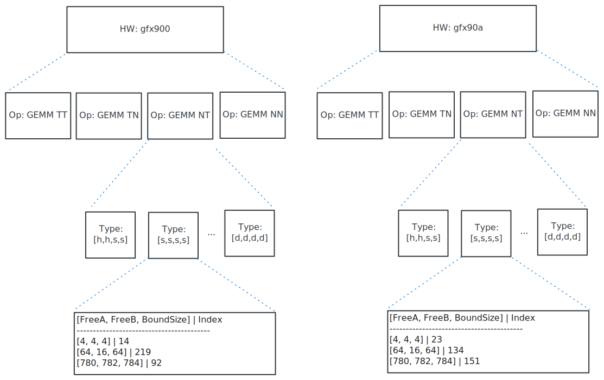

.. meta::
  :description: Tensile is a tool for creating a benchmark-driven backend library for GEMM
  :keywords: Tensile, GEMM, Tensor, Tensile API documentation, Tensile library creation

.. _solution-selection-catalogs:

**************************************
Tensile solution selection catalogs
**************************************

To avoid the overhead associated with loading code object files including initialization time and the memory footprint of the loaded code object files,
Tensile provides a mechanism to load only a subset of the code object files produced during a build, at runtime.
To achieve this, it must be determined which code object file to load.
To determine the preferred kernel and the code object file containing the selected kernel,
the ``TensileHost`` library utilizes a process named `Solution selection`.
This process uses a hierarchical structure to efficiently search for kernels based on hardware, problem size, and transpose, among others.

For efficient lookup at runtime, the kernel metadata must be organized in a hierarchical schema in a serialized file named `solution selection catalog` [1]_.

.. note::
    This document refers to the catalog files with .yaml extension. In practice,
    solution selection catalogs are usually serialized with `MessagePack <https://msgpack.org/>`_, which uses the .dat extension.

Solution selection catalog hierarchy
=====================================

    Solution selection catalog heirarchy for gfx900 and gfx90a

.. note::

  In the figure, the levels are numbered from top to bottom.

**Level 1: Hardware**

At runtime, only kernels compatible with the device can execute. As such, the top level of the hierarchy involves hardware comparisons using GFX architecture.

**Level 2: Operation**

This layer is a mapping between a GEMM transpose setting defined using
Einstein tensor notation (such as *Contraction_l_Alik_Bjlk_Cijk_Dijk*) and a list of problem properties.

**Level 3: Problem**

This layer matches against specific problem properties such as input and output types, and features like high precision accumulation and stochastic rounding.

**Level 4: Exact solution**

Finally, exact solutions contain fine-grained details about each solution that can be used during solution selection to locate the best kernel and ensure the fulfillment of the requested problem predicates. Each kernel has an index and a performance ranking. During solution selection, the highest-ranked
kernel from this pool is selected.

Build modes
===========

Tensile is equipped with multiple build modes that affect how solution selection catalogs are generated.

Mode 1: Lazy library loading
----------------------------

If ``--lazy-library-loading`` is enabled, then the following `parent` catalog is generated for each architecture:

.. centered:: TensileLibrary_lazy_<gfx>.yaml

This parent catalog contains a reference to each of its `child` catalogs without the details about the exact solutions.
These settings are present in the `child` catalogs, which use the following naming convention:

.. centered:: TensileLibrary_Type_<precision>_<problem type>_<gfx>.yaml

In the preceding naming convention:

- <precision>: Data type
- <problem type>: GEMM type, including transpose and accumulate settings
- <gfx>: Hardware GFX architecture

For example, *TensileLibrary_Type_HH_Contraction_l_Alik_Bjlk_Cijk_Dijk_<gfx>.yaml* identifies a code object library for half-precision
contractions on two transpose matrices, otherwise known as HGEMM TT.
In this way, the child catalogs contain the solution metadata, while the parent catalog organizes the child catalogs
by hardware, problem type, transpose, precision, and other predicates.
This reduces the memory footprint of the calling application, as code object libraries are compiled separately and loaded only when required.

**Example: Build output**

.. code-block:: bash
  :caption: Lazy library loading build outputs for *DD_Contraction_l_Alik_Bjlk_Cijk_Dijk*

  build/
  └── library/
      ├── Kernels.so-000-gfx1030.hsaco
      ├── Kernels.so-000-gfx900.hsaco
      ├── Kernels.so-000-gfx906.hsaco
      ├── TensileLibrary_lazy_gfx1030.yaml                   # [A]
      ├── TensileLibrary_lazy_gfx900.yaml
      ├── TensileLibrary_lazy_gfx906.yaml
      ├...
      ├── TensileLibrary_Type_..._fallback_gfx1030.hsaco
      ├── TensileLibrary_Type_..._fallback_gfx900.hsaco
      ├── TensileLibrary_Type_..._fallback_gfx906.hsaco
      ├── TensileLibrary_Type_..._fallback.yaml              # [B]
      ├── TensileLibrary_Type_..._gfx900.co
      ├── TensileLibrary_Type_..._gfx900.hsaco
      ├── TensileLibrary_Type_..._gfx900.yaml                # [C]
      ├── TensileLibrary_Type_..._gfx906.co
      ├── TensileLibrary_Type_..._gfx906.yaml                # [D]

Note that the lines in the build output are marked as A, B, C, and D for reference.

- Line [A]: Shows the parent catalog for gfx1030, the first of the three parent catalogs generated.

- Line [B]: Shows a fallback child catalog that references each of the architecture-specific fallback kernels in the associated ``.hsaco`` files.
  This implies that at least some of the parameter or problem type combinations for *DD_Contraction_l_Alik_Bjlk_Cijk_Dijk*
  haven't been explicitly tuned for these architectures.
  Note that the matching ``.hsaco`` files (above line [B]) are code object libraries for HIP source kernels.
  These files are referenced by the fallback catalog.

- Line [C]: Shows a child catalog for gfx900 that references both HIP source and assembly source kernels found in the associated ``.hsaco`` and ``.co`` files, respectively.

- Line [D]: Shows a child catalog for gfx906, similar to the gfx900 catalog. However, notice that there is only one associated
  ``.co`` file. This implies that the catalog contains only assembly source kernels.

**Example: Parent solution selection catalog**

.. code-block:: yaml
  :caption: build/library/TensileLibrary_lazy_gfx900.yaml

  library:
    rows:                                                    # [A_]
    - library:
        map:
          Contraction_l_Alik_Bjlk_Cijk_Dijk:                 # [B_]
            ...
            rows:                                            # [C_]
            - library: {type: Placeholder, value: TensileLibrary_Type_SS_..._fallback}
              predicate:
                type: And
                value:
                - type: TypesEqual
                  value: [Float, Float, Float, Float]
                - {type: HighPrecisionAccumulate, value: false}
                - {type: F32XdlMathOp, value: Float}
                - {type: StochasticRounding, value: false}
            - ...
            type: Problem
            ...
          Contraction_l_Alik_Bljk_Cijk_Dijk:
            rows:
              - ...
            type: Problem                                    # [_C]
        property: {type: OperationIdentifier}
        type: ProblemMap                                     # [_B]
      predicate: {type: TruePred}
    type: Hardware                                           # [_A]
  solutions: []

Note that the lines in the parent catalog are marked as A, B, and C for reference.

- Line [A]: Shows the top level of the parent catalog, which contains a single row for each hardware architecture.
- Line [B]: Shows the problem map for the operation *Contraction_l_Alik_Bjlk_Cijk_Dijk*.
- Line [C]: Shows the problem type and predicates used to match against exact solutions present in the child catalogs.

Mode 2: Merge files
-------------------

.. warning::

  This feature is not recommended as it is on the verge of deprecation.

When ``--merge-files`` is enabled, one solution catalog is generated for each architecture, named:

.. centered:: TensileLibrary_<gfx>.yaml

The catalog contains information about supported GEMM types and
solution metadata that is used to locate the optimal kernel for a requested GEMM. Note that this pattern increases both the initialization time and memory footprint of the calling application
as all code object libraries are loaded eagerly.

**Example: Build output**

Here is the build output directory when building libraries for gfx908 and gfx90a with ``--merge-files``:

.. code-block:: bash

    build/
    └── library/
        ├── Kernels.so-000-gfx1030.hsaco
        ├── Kernels.so-000-gfx1030.hsaco
        ├── Kernels.so-000-gfx1030.hsaco
        ├── Kernels.so-000-gfx900.hsaco
        ├── Kernels.so-000-gfx906.hsaco
        ├── TensileLibrary_gfx1030.co
        ├── TensileLibrary_gfx1030.yaml
        ├── TensileLibrary_gfx900.co
        ├── TensileLibrary_gfx900.yaml
        ├── TensileLibrary_gfx906.co
        └── TensileLibrary_gfx906.yaml

--------------------

.. [1] Previously these files were named *master solution libraries* because they consisted of two top-level keys, "solutions" and "library". The term *solution selection catalog* was later adopted to clarify the purpose of this file within the larger context of the Tensile C++ API.